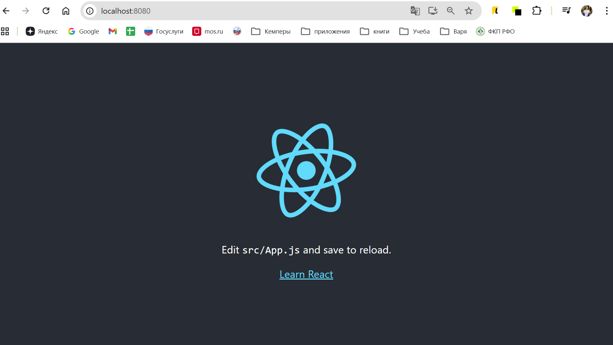

# React App in Docker

React-приложение с многоступенчатым Dockerfile, сборкой и запуском образа, репозиторием на GitHub, оформлением README.md



## Сборка и запуск

1. **Сборка Docker-образа:**
   ```bash
    docker build -t react-app:latest .
    docker images react-app
    docker run -d -p 8080:80 --name react-app-final react-app:latest
    docker ps
